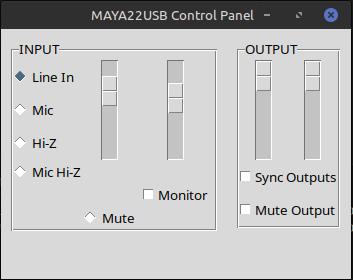

# GUI for ESI Maya22 USB

This project provides a command line interface and a graphical interface to control the [ESI Maya22](http://www.esi-audio.com/products/maya22usb/) usb sound device. The interface allows you to adjust input and output volumes, enable/disable monitoring and headphones, and synchronize output volumes. Configuration is automatically saved to a JSON file.

The graphical interface is achieved by running the "main.py" file, which launches a GUI using python-tk. This interface interacts with "maya22-control.py," which communicates with the python-hidapi library responsible for sending and receiving data with the Maya22 USB sound interface.

1. `.command/maya22-control.py` - Can be used via command line. More information is available in the readme.md. It handles sending and receiving data from the sound card using the hidapi library.

2. `main.py` - Launches a graphical interface through which you can interact with `maya22-control.py`. Commands can be sent via the graphical interface.

## General Features

- Adjust input volumes (left and right).
- Adjust output volumes (left and right).
- Automatic synchronization of output volumes.
- Enable and disable monitoring.
- Enable headphones (all output).
- Select input channel.
- Automatic configuration saving in a JSON file.

## Requirements

- Python 3.x
- Tkinter for Python - The standard Python library for creating graphical user interfaces (GUIs). It provides a simple way to build desktop applications using Python with a native look and feel on different operating systems.
- HIDAPI for Python - A Python library that provides cross-platform support for communicating with USB and Bluetooth Human Interface Devices (HID). It allows easy interaction with HID devices like keyboards, mice, game controllers, and more.

## Installation

1. Clone this repository:

   `git clone https://github.com/piposeimandi/esi-maya22-linux-gui`

2. Navigate to the project directory:

   `cd esi-maya22-linux-gui`

## Installing Dependencies for ESI Maya22 Controller

### For Debian/Ubuntu Systems

To install the required dependencies using `apt-get`, follow these steps:

1. Update your package list:

   `sudo apt-get update`

2. Install the necessary packages:

   `sudo apt-get install python3 python3-tk python3-hid`

This will install Python 3, the Tkinter GUI toolkit, and HID support.

### For Arch Linux Systems

To install the required dependencies using `pacman`, follow these steps:

1. Update your system:

   `sudo pacman -Syu`

2. Install the necessary packages:

   `sudo pacman -S python python-tk python-hidapi`

These commands will install Python, Tkinter, and HID support on Arch Linux.

## After Installation

Once the dependencies are installed, you can run the Python script as usual:

   `python3 main.py`

## Configuration

Configuration is saved in a JSON file named `config.json` in the same directory as the script. Settings are automatically loaded from this file when the application starts.

## Information

It was made possible thanks to the original `maya22-control` from the [rabits/esi-maya22-linux](https://github.com/rabits/esi-maya22-linux) repository.

## Contributions

Contributions are welcome. If you find any bugs or have improvements to propose, please open an issue or a pull request.

## License

This project is licensed under the MIT License. See the [LICENSE](LICENSE) file for more details.

## Contact

For any questions or comments, please contact [bajosega@gmail.com](mailto:bajosega@gmail.com).

# Control + GUI en Python para ESI Maya22 USB

Este proyecto proporciona una interfaz de línea de comandos y una interfaz gráfica para controlar la [ESI Maya22](http://www.esi-audio.com/products/maya22usb/).  La interfaz permite ajustar los volúmenes de entrada y salida, habilitar/deshabilitar monitoreo y auriculares, y sincronizar los volúmenes de salida. La configuración se guarda automáticamente en un archivo JSON.

La interfaz gráfica se logra ejecutando el archivo "main.py", que inicia una GUI utilizando python-tk. Esta interfaz interactúa con "maya22-control.py", que se comunica con la biblioteca python-hidapi responsable de enviar y recibir datos con la interfaz de sonido USB Maya22.

1. `.command/maya22-control.py` - Puede utilizarse a través de la línea de comandos. Más información está disponible en el readme.md. Se encarga de enviar y recibir datos desde la placa de sonido mediante la biblioteca hidapi.

2. `main.py` - Inicia una interfaz gráfica a través de la cual puedes interactuar con `maya22-control.py`. Los comandos se pueden enviar a través de la interfaz gráfica.

## Funciones Generales

- Ajustar los volúmenes de entrada (izquierda y derecha).
- Ajustar los volúmenes de salida (izquierda y derecha).
- Sincronización automática de los volúmenes de salida.
- Habilitar y deshabilitar monitoreo.
- Habilitar auriculares (toda la salida).
- Seleccionar canal de entrada.
- Guardado automático de la configuración en un archivo JSON.

## Requisitos

- Python 3.x
- Tkinter para Python - La biblioteca estándar de Python para crear interfaces gráficas de usuario (GUIs). Proporciona una forma simple de construir aplicaciones de escritorio utilizando Python con un aspecto y una sensación nativos en diferentes sistemas operativos.
- HIDAPI para Python - Una biblioteca de Python que proporciona soporte multiplataforma para comunicarse con dispositivos de interfaz humana (HID) USB y Bluetooth. Permite una fácil interacción con dispositivos HID como teclados, ratones, controladores de juegos, y más.

## Instalación

1. Clona este repositorio:

   `git clone https://github.com/piposeimandi/esi-maya22-linux-gui`

2. Navega al directorio del proyecto:

   `cd esi-maya22-linux-gui`

## Instalación de Dependencias para el Controlador ESI Maya22

### Para Sistemas Debian/Ubuntu

Para instalar las dependencias requeridas utilizando `apt-get`, sigue estos pasos:

1. Actualiza tu lista de paquetes:

   `sudo apt-get update`

2. Instala los paquetes necesarios:

   `sudo apt-get install python3 python3-tk python3-hid`

Esto instalará Python 3, el toolkit GUI de Tkinter y soporte HID.

### Para Sistemas Arch Linux

Para instalar las dependencias requeridas utilizando `pacman`, sigue estos pasos:

1. Actualiza tu sistema:

   `sudo pacman -Syu`

2. Instala los paquetes necesarios:

   `sudo pacman -S python python-tk python-hidapi`

Estos comandos instalarán Python, Tkinter y soporte HID en Arch Linux.

## Después de la Instalación

Una vez que las dependencias estén instaladas, puedes ejecutar el script de Python como de costumbre:

   `python3 main.py`

## Configuración

La configuración se guarda en un archivo JSON llamado `config.json` en el mismo directorio que el script. Los ajustes se cargan automáticamente desde este archivo cuando la aplicación se inicia.

## Información

Fue posible gracias al original `maya22-control` del repositorio [rabits/esi-maya22-linux](https://github.com/rabits/esi-maya22-linux).

## Contribuciones

Las contribuciones son bienvenidas. Si encuentras algún error o tienes mejoras que proponer, por favor abre un problema o una solicitud de extracción.

## Licencia

Este proyecto está licenciado bajo la Licencia MIT. Consulta el archivo [LICENSE](LICENSE) para más detalles.

## Contacto

Para cualquier pregunta o comentario, por favor contacta a [bajosega@gmail.com](mailto:bajosega@gmail.com).
